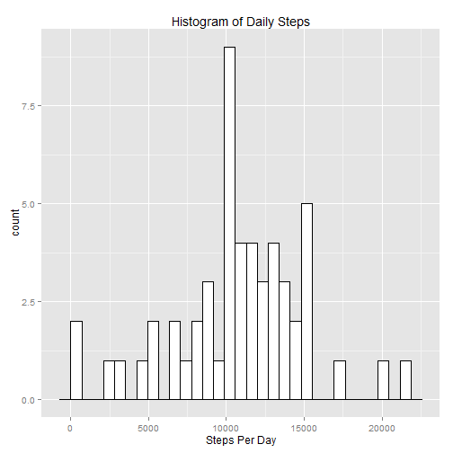
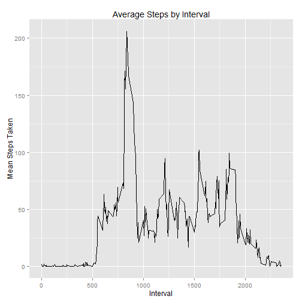
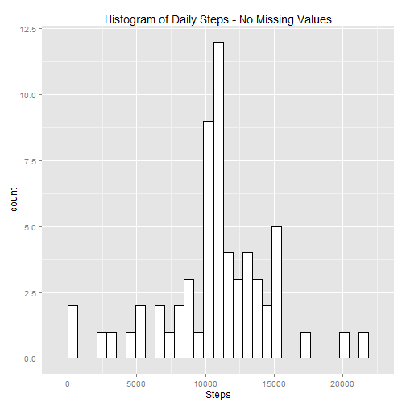
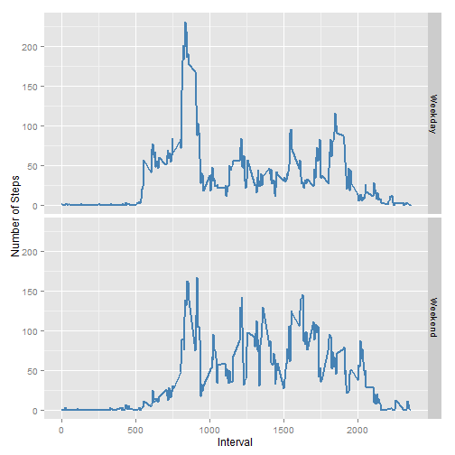

It is now possible to collect a large amount of data about personal movement using activity monitoring devices such as a Fitbit, Nike Fuelband, or Jawbone Up. These type of devices are part of the "quantified self" movement -- a group of enthusiasts who take measurements about themselves regularly to improve their health, to find patterns in their behavior, or because they are tech geeks. But these data remain under-utilized both because the raw data are hard to obtain and there is a lack of statistical methods and software for processing and interpreting the data.


First we need to read in the data and get it ready for analysis.


```r
data <- read.csv("activity.csv", stringsAsFactors = FALSE)

data$date <- as.Date(data$date, "%Y-%m-%d") #convert the dates to DATE 

data_nona <- data[which(!is.na(data$steps)), ] #supplies a dataset with missing "steps" removed
```

Then we'll answer the question "what is the mean and median total steps per day" and provide a histogram.


```r
daily_steps <- summarize(group_by(data_nona, date), steps = sum(steps))

mean_steps <- round(mean(daily_steps$steps))
median_steps <- round(median(daily_steps$steps))
```
The mean steps taken per day are 10766 and the median value is 10765.


```r
g <- ggplot(daily_steps, aes(x=steps))

g <- g + geom_histogram(color="black", fill="white") + labs(x = "Steps Per Day") + ggtitle("Histogram of Daily Steps")

print(g)
```

 

Question 2: What is the average daily activity pattern? 

```r
avg_steps <- summarize(group_by(data_nona, interval), steps = mean(steps))

g <- ggplot(avg_steps, aes(x= interval, y = steps))

g <- g + geom_line() + labs(x = "Interval") + labs(y = "Mean Steps Taken") + ggtitle("Average Steps by Interval")

print(g)
```

 

... and which Interval value contains the maximum average steps?

```r
avg_steps[[which.max(avg_steps$steps), "interval"]]
```

```
## [1] 835
```

Question 3: Imputing Missing Values  
In order to extraploate some values to those which are missing in the initial dataset, I'll use the mean number of steps by Interval across all days.

```r
avg_steps <- round(summarize(group_by(data_nona, interval), steps = mean(steps)))

## Then we have to join the original dataset to the average steps dataset (using dplyr)
new_ds <- inner_join(data, avg_steps, by = "interval", copy = TRUE)

## Create the final "steps" value
new_ds$steps_final <- ifelse(is.na(new_ds$steps.x),new_ds$steps.y, new_ds$steps.x) 

### create the final dataset
final_ds <- new_ds[, c("date", "interval", "steps_final")]
names(final_ds)[names(final_ds) == "steps_final"] <- "steps"
```
Now, let's plot the results of the dataset with the missing values filled in.

```r
hist_ds <- summarize(group_by(final_ds, date), steps = sum(steps))

g <- ggplot(hist_ds, aes(x = steps))

g <- g + geom_histogram(color="black", fill="white") + labs(x = "Steps") + ggtitle("Histogram of Daily Steps - No Missing Values")

print(g)
```

 
 
What are the Mean and Median steps values in this new dataset?

```r
hist_mean_steps <- round(mean(hist_ds$steps))
hist_median_steps <- round(median(hist_ds$steps))
```
The mean steps taken per day are 10766 and the median value is 10762 according to the dataset with missing values extrapolated.  
Compared to the initial analysis, the mean value has not differed in any notable way but the median value has decreased slightly. We can conclude that by extrapolating missing values we have shifted the distribution slightly lower and thus see a lower median step value.

Question 4: Are there differences in activity patterns between weekdays and weekends?

To achieve this analysis we must create a variable in our dataset to differentiate "weekdays" (Monday - Friday) and "weekend" days (Saturday and Sunday). We will create a two-level factor variable and plot the results by this new variable.


```r
# Add weekdays to dataset as two-level factor
final_ds$wkday <- as.factor(ifelse(weekdays( final_ds$date) %in% c("Saturday","Sunday"), "Weekend", "Weekday"))

# Ggplot2 two facet average steps by interval: weekday vs. weekend

wkd_hist_ds <- summarize(group_by(final_ds, wkday, interval, add= TRUE), steps = mean(steps))

g <- ggplot(wkd_hist_ds, aes(x = interval, y = steps))

g <- g + geom_line(color = "steel blue", size = 1) + facet_grid(wkday ~ .)  + ylab("Number of Steps") + xlab("Interval")

print(g)
```

 

We can see in the final analysis that the number of steps taken on average does vary a bit. The most obvious difference is that we see a spike of activity earlier in the day on a Weekday, but the steps taken on the weekend are generally more consistent.
